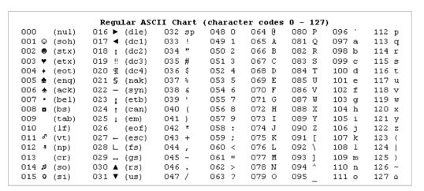

## [ 문자열 인코딩 ]

### 핵심 한 줄 요약
    각 인코딩 방식의 차이를 숙지하고, 인코딩 관련 문제가 생기지 않게 노력하자!

### 문자열 인코딩이란?
- 인간의 언어를 일정 규칙에 따라 2진수로 변환하는 방식 -> 컴퓨터가 읽을 수 있어야 하니까!
- 아스키 코드, EUC-KR, UTF-8, UTF-16, UTF-32 등등 여러가지가 있다.
- 어떠한 인코딩 규칙을 적용하냐에 따라서 글자가 올바르게 보일 수도, 깨져 보일 수도 있다.
- 인코딩 방식에 따라 문자열의 길이와 버퍼의 길이가 다른 경우가 많다. 이걸 꼭 명심하고 있자.

### 아스키 코드(ASCII)
- 처음으로 표준을 정립한 문자열 인코딩 방식
- 1바이트(8비트) 만으로 문자 하나를 표현이 가능하다.
- 대문자, 소문자, 아라비아 숫자, 공백, 특수 문자 등이 있으며 0부터 127까지의 숫자를 사용해서 문자를 표현한다.
- 
- 근데 컴퓨터는 2진수 데이터를 하나의 형태로만 인식하기 때문에 숫자와 문자를 동시에 인식할 수 없다.
- 그래서 숫자를 나타내는 문자도 있다.
- 근데 영어를 제외한 다른 언어는 표현할 수 없어서 여러 나라들이 독자적인 인코딩 방식을 만들어 사용했다.

### EUC-KR(CP949)
- 한글을 표현하는 방법으로 우리나라가 만든 인코딩 방식이다.
- 2바이트로 문자 하나를 표현하는데 아스키 코드 문자를 사용할 때는 1바이트를 사용하기 때문에 아스키 코드와 호환된다.
- 근데 한글처럼 초성, 중성, 종성을 조합해 문자를 만들 수 없기 때문에 EUC-KR로 표현할 수 없는 한글도 존재한다.

### 유니코드(UTF-8, UTF-16, UTF-32)
- 각 나라의 언어별로 다른 인코딩 방식을 사용하니 개발자 입장에서는 너무 힘들었다고 한다.
- 그래서 국제 표준화 기구(ISO) 에서 동일한 규칙으로 모든 언어를 표현할 수 있는 유니코드 문자 집합을 만들었다.
  - UTF-8:
    - 1바이트로 인코딩하는 것을 의미한다. 최소 1바이트 ~ 최대 6바이트까지 사용한다.
    - 아스키 코드와 완벽하게 호환된다.
    - JSON 은 이 인코딩만 사용한다.
  - UTF-16:
    - 2바이트로 인코딩하는 것을 의미한다. 2바이트, 4바이트만 사용한다.
    - 아스키 코드와 호환되지 않는다.
    - 일반 글자를 2바이트, 특별한 글자(쐐기 문자, 키프로스 음절 문자 등)를 4바이트를 사용해 인코딩한다.
  - UTF-32:
    - 4바이트를 고정적으로 사용한다.
    - 반드시 UTF-32를 사용해야 하는 환경이 아니라면 사용하지 않는다.

