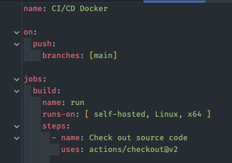

## [ YAML ]

### 핵심 한 줄 요약
    이 기회로 주석, 앵커, 별칭 등 특징을 알게 되었으니 잘 활용해보자

### 인트로
- YAML 은 또 다른 마크업 언어 라는 뜻을 가졌다.
- 사람이 쉽게 읽을 수 있는 데이터 규격이다.
- JSON 과 별 차이가 없어 보이지만, 고유한 특징 덕분에 영역이 점점 넓어지고 있다.

### 특징
- 주석 지원:
  - 설정 파일에서도 많이 쓰여서 아주 유용하다.
- UTF-8, UTF-16 지원:
  - UTF-16도 지원해서 윈도우, 자바에서 만든 소프트웨어의 설정 파일로도 사용할 수 있다.
  - 근데 UTF-8로 통일하는게 좋다.
- 앵커와 별칭:
  - 앵커: & 으로 시작
  - 멸칭: * 로 시작 
  - 별칭을 사용하면 어디서든 앵커로 지정된 값을 사용할 수 있다.

### 구조
- ex) 내 github action main.yml
- 
- JSON과 다르게 중괄호 대신 띄어쓰기로 들여쓰기를 하고 구분한다. => *탭을 사용하면 인식이 안된다!
- #으로 시작하면 주석으로 처리된다.

### 단점
- 바이너리 규격에 비해 비효율적이며, JSON 만큼 범용적으로 사용되지 않는다.
- JS에서는 별도의 파서를 사용해서 읽어야 한다.
