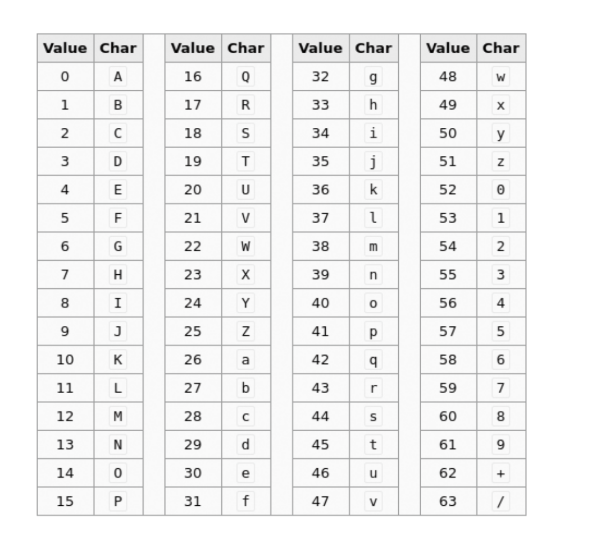

## [ Base64 ]

### 핵심 한 줄 요약
    Base64는 JSON과 RESTful API에서 바이너리 데이터를 주고받을 때 많이 사용하며, 너무 큰 파일을 보내기에는 적합하지 않다.

### 인트로
- HTTP API를 보면 ==로 끝나는 문자열을 만나게 된다.
- 높은 확률로 Base64이다.
- 바이너리 데이터를 아스키 코드 일부와 일대일로 매칭하는 문자열로 단순 치환하는 인코딩 방식이다.
- 데이터가 30%정도 늘어나는 단점이 있다.

### 왜 쓸까?
- 바이너리 데이터를 텍스트 기반 규격으로 다를 수 있기 때문이다.
    - 와 이러면 이미지도 JSON 안에 넣어 보낼 수 있다. Base64가 UTF-8과 호환이 가능하기 때문이다.

### 변환법
- javascript 는 btoa로 만들고, atob로 원복한다.

### Base64 코드 표

### 패딩(==)을 추가하는 이유
- 비트 배열이 3바이트로 정확히 나눠 떨어지지 않으면 3바이트로 나눠 떨어질 때까지 0을 추가하고 그 만큼 패딩을 붙인다.
- 즉 1바이트 부족 => = , 2바이트 부족 => ==
- JSON, HTTP 에서는 그렇게 중요하지 않다.
- 하지만 TCP처럼 스트림 형태로 데이터를 주고받는 환경에서 패딩이 없는 데이터를 받을 때 문제가 될 수 있다.
- ex) 네트워크 프로토콜로 데이터를 3바이트 씩 끊어서 디코딩하는 상황
  - 패딩이 있으면:
    - 3바이트 기준으로 2바이트가 모자란 상황에서도 패딩으로 채워 올바른 데이터로 볼 수 있고, 다음 작업을 똑같이 진행한다.
  - 패딩이 없으면:
    - 모자란 데이터가 있을 때 3바이트를 채우기 위해 다음 스트림이 올 때까지 기다려야 하는지, 이번에 받은 스트림이 끝인지 명확하게 알 수 있는 방법이 없다.
    - 데이터 길이를 알고 있으면 지정된 길이만큼 자르면 되지만 그게 안되면 문제가 될 수 있다.

### URL-Safe Base64
- Base64는 일반적으로 URL과 함께 쓸 일이 없지만, 가끔 있다.
- 이럴 때 URL 주소에서 사용할 수 없는 문자들을 변환해서 사용한다.
- (+ => -) or (/ => _) or (= => .) 으로 치환한다. 
- = <- 이거 패딩 아냐? URL은 항상 주소의 길이를 알기 때문에 패딩은 생략한다.
