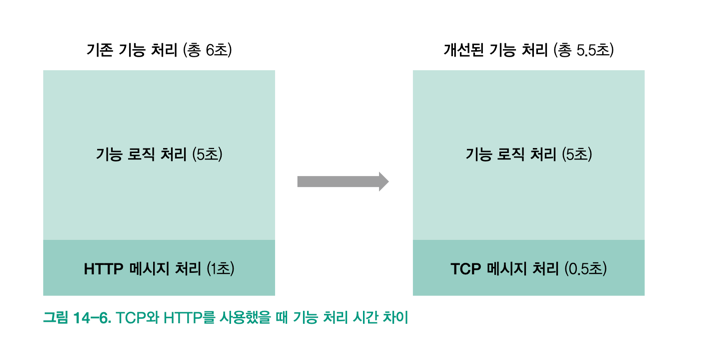

## [ HTTP ]

### 핵심 한 줄 요약
    우리가 놀고 있는 HTTP의 특징들을 쭉 비교해봤는데 다 중요해서 가볍게 자주 읽어보자 ㅎㅎ

### 인트로
- HTTP 는 서버와 클라이언트가 텍스트, 이미지, 동영상 등의 데이터를 주고받을 때 사용하는 프로토콜이다.
- 텍스트 기반 데이터: HTML, CSS, javascript 등등 웹서비스 동작에 필요한 요소
- 그 외 데이터: JSON, XML, 바이너리는 Base64 인코딩해서 등등
- 지금은 HTTP + TLS(전송 보안 계층) => HTTPS 를 사용한다.
- 모바일 기기 통신, 웹 서비스 통신등에는 HTTPS만 사용하도록 권고하는 추세이다.

### 무상태성
- HTTP 는 요청 메시지를 보내기 직전까지 대상 컴퓨터가 연결 가능한지, 응답할 수 있는 상태인지 알 수가 없다.
- 그래서 HTTP 는 상태가 없는 프로토콜이라고 한다.
- 모든 HTTP 메시지는 요청과 응답이 1:1 로 대응되어야 하므로 요청을 받은 서버는 반드시 응답을 보내야 한다.
- 그러나 HTTP 요청을 보내기 전에는 서버가 살아있는지 알 수 있는 방법이 없다.
- 클라이언트는 어떤 이유로든 응답이 느리면 타임아웃으로 간주하고 요청을 실패로 처리 한다.
- 타임아웃 시간과 최대 재시도 횟수는 서버의 평균적 부하, 실패 확률, 사용자가 이해할만한 시간인지? 등을 따져서 신중히 결정해야 한다.
- 각 요청이 소켓 1개를 점유하며 서버는 응답을 주고 바로 소켓을 닫는다.

### HTTP 와 비교를 위한 간단한 TCP
- TCP(전송 제어 프로토콜) 은 상태가 있는 프로토콜이라고 한다.
- TCP 는 HTTP 와 같이 연결을 끊지 않고 명시적으로 연결을 닫기 전까지 계속 메시지를 주고 받는다.
- HTTP 는 텍스트 데이터, JSON, XML 뭐 등등 주고 받지만 TCP 는 바이너리 데이터를 주고 받는다.
- HTTP 는 헤더와 메시지까지 사용해서 패킷 크기가 상당히 큰데 TCP 패킷 크기는 그거 보다는 가벼워서 TCP 가 더 빠를 수 밖에 없다.
- TCP 는 모든 요청이 소켓 1개를 사용해서 그 안에 다 섞여버리게 된다. => 별도로 ID 같은 식별자를 안두면 요청과 응답이 1:1 매칭 구분이 안된다.
- TCP 는 프로토콜에서 응답이 왔는지 확인할 방법이 없어 타임아웃 기능도 직접 구현해야 한다.
- 모바일에서 TCP를 사용할 때는 더욱 조심해야 한다. 연결이 자주 끊어져서 재연결 시도 시 안전한 제어 로직을 직접 구현해야 한다.

### HTTP, TCP 묶어서
- TCP 는 HTTP 보다 상대적으로 빠르지만 개발자가 연결 사앹를 직접 관리해야 해서 로직이 복잡하다.
- HTTP 는 로직이 간단하지만 TCP 보다는 느리다.
- 서버 <-> 클라이언트 간에 주고받는 메시지가 많다고 무조건 TCP 를 사용해야 하는 건 아니다.
- 서버야 늘리면 그만이고, 실질적으로 서버의 동작을 실행하는 시간은 둘이 비슷하다.
- TCP 는 실시간 멀티플레이 게임, 금융 서비스처럼 1초 사이에 주고 받는 데이터가 많기 때문에 메시지 처리 시간이 로직 처리보다 오래 걸리는 경우에만 사용하는게 좋다.
- ex)

### URL
- 웹 주소, 요청 주소라고 하며, HTTP 에서 통신할 대상 컴퓨터를 식별할 때 사용한다.
- URL 주소는 '사람이 기억하기 쉽게' 만든 식별자에 불과하다.
- 실제로 통신할 때는 IP를 사용하기 때문에 통신을 위해서는 URL을 IP로 변환하는 작업이 필요하다.
- 이 작업은 DNS(도메인 네임 시스템)을 통해 할 수 있다.
- 웹 브라우저는 URL이 아닌 DNS로 부터 받은 IP 주소로 실제 접속을 요청한다.
- 하나의 URL이 여러 IP 주소를 가질 수도 있다.
- 클라이언트가 IP 주소를 요청할 때 마다 DNS가 여러 IP 주소 중 하나로 보내면서 서버 부하를 줄일 수도 있다. 
- 이 기능을 DNS 라운드 로빈, DNS 로드 밸런싱 이라고 한다.
- URI?:
  - 특정 문서, 영상 등과 같은 자원의 위치를 가르킬 때 사용하는 용어이다.
  - URI는 URL 주소 말고 XML 에서도 사용한다. 
  - URL을 쓰는 곳에서는 URI로 표기해도 문제는 없지만, 혼용할 수 없는 경우도 있다.

### HTTP 버전
- HTTP 표준을 정의하는 버전으로, 버전에 따라 사용할 수 있는 기능과 통신 방법이 조금씩 다르다.
- 현재는 1.0, 1.1, 2.0 이 있다.
- 1.1 버전은 1.0 버전보다 효율적인 연결을 위해 소켓 재사용을 요청하는 keep-alive 헤더 추가, 언어 및 인코딩 지원을 위한 헤더 등이 추가 되었다.
- 그래서 오늘날은 대부분 1.1 버전의 HTTP 를 ㅏㅅ용한다.
- 그러나 1.1 버전은 하나의 요청에 하나의 응답만 보낼 수 있다.
- 한 번의 요청에 수십 개의 응답을 병렬로 보낼 수 있도록 개선하고 불필요한 오버헤드를 제거한 것이 2.0 버전이다.

### HTTP 상태 코드와 메시지
- 2xx 에서 5xx 까지 있다.
- 하나하나 의미는 mdn 에서 찾아보고 대략적으로
- 2xx: 성공
- 3xx: 서버 이동
- 4xx: 클라이언트가 잘못 요청함
- 5xx: 서버가 이상함
- 으로 보면 된다.

### 세션과 쿠키
- 상태라는 개념이 존재하지 않는 HTTP는 보낸 요청에 대한 응답은 구분할 수 있어도, 이전에 어떤 요청을 보냈는지는 모른다.
- 모든 요청이 독립적으로 소켓 1개를 사용하고, 모든 요청이 다른 요청과 독립되기 떄문이다.
- Host, IP, 포트 주소 등으로는 명확하게 구분할 수 없다.
- 이 문제를 해결하기 위해 웹 서버는 쿠키와 세션 ID 를 사용해 클라이언트를 구분한다.
- 구현은 늘 하던 방법말고 또 재밌는게 있나 찾아보자
- 세션과 쿠키를 오래 가지고 있으면 메모리 할당 외에 잠재적으로 여러 보안 문제가 발생할 수 있다.
- 그래서 만료 시간도 함께 지정해야 한다.

### 쿠키를 안전하게 사용하자
- 쿠키는 해커들이 자주 공격하는 곳이다.
- HTTPS 를 필수적으로 사용하고, HTTP로 접속해도 HTTPS로 접속하게 해야 하는 것이 기본이다.
- 언제든 쿠키가 변조될 수 있다는 걸 염두에 두고 개발해야 한다.
- 사생활에 대한 법적 기준은 국가마다 다르지만 쿠키에서 수집한 정보가 무엇인지 구체적으로 공개해야 한다.
- 그리고 수집을 거부했을 때의 불이익도 없어야 한다.
- 따라서 쿠키로 수집한 모든 종류의 정보를 사용자에게 공개하고 동의를 구해야 하며, 쿠키 수집 거부가 동작에 큰 영향을 주지 않아야 한다.
- 쿠키 설정 시 'Secure' 옵션을 추가하면 HTTPS로 통신할 때만 쿠키를 서버로 전송한다. 'HttpOnly' 옵션을 추가하면 웹브라우저의 document.cookie 동작을 막을 수 있다.

### 스티키 세션
- 로드밸런서가 세션 기간 동안 동일한 클라이언트의 요청을 항상 동일한 서버로 라우팅 해주는 기능이다.
- 스티키 세션을 사용할 때는 세션 유지 기간도 함께 설정하게 된다.
- 세션 유지 기간은 웹 서버에서 사용하는 쿠키 만료 시간보다 길게 설정하는 것이 좋다.=> 안그러면 웹 서버에 쿠키가 있는 대도 다른 곳으로 요청이 갈 수도 있다.

### CORS
- CORS(교차 출처 리소스 공유) 는 HTTP 서버의 웹 페이지 , 이미지 파일이나 API 을 특정 호스트로 접속한 웹 브라우저에서만 사용하게 하는 정책이다.
- 웹 서비스는 수많은 서브 도메인으로 구성되어 있어 실무에서 아주 골치 아프다.
- 서버에서 설정으로 길을 만들어 줄 수 있으며, 이 방어 정책이 브라우저에만 해당하므로 웹 서버가 해킹되면 데이터 유출은 막을 수 없다.
- 단순 요청:
  - 요청 정보가 간단해 보안 검증이 필요하지 않은 CORS를 뜻한다. 아래와 같은 조건일 때 사용할 수 있다.
  - GET, HEAD, POST 메서드를 사용하는 경우
  - POST 일 떄 Content-Type이 text/plain, application/x-www-form-urlencoded, multipart/form-data 일 경우
  - 표준에 정의되지 않은 사용자 헤더를 쓰지 않는 경우
- 사전 요청:
  - 추가적인 보안 검증이 필요한 요청으로 단순 요청을 적용할 수 없을 때 사용한다.
  - OPTIONS 메서드일 때, My-HTTP-Header 라는 헤더 값이 필요한 경우에는 해당 서버로 사전 요청을 먼저 한다.
  - 사전 요청을 하면 총 2개의 HTTP 요청이 필요해서 요즘 웹 브라우저는 사전 요청 겨로가를 최대 10분까지 캐시에 저장해둔다.

### 아파치와 Nginx
- 개발자가 HTTP 표준에 부합한 웹 서버를 처음부터 만드는 것은 매우 어렵고, 비효율적이다.
- 요청 처리 뿐만 아니라 정적 파일 캐시, 로드 밸런스, 압축, 보안 등등 고려해야 할 점이 너무 많다.
- 바로 적용해 사용할 수 있는 오픈 소프트웨어가 아파치와 Nginx 이다.
- 아파치는 20년 전부터 안전성이 입증됐고, 인증이나 많은 기능을 제공한다.
- Nginx는 아파치보다 성능도 좋고, 가벼운 구조로 현재 범용적인 웹 서버로 사용하고 있다.
