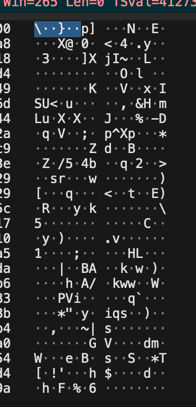
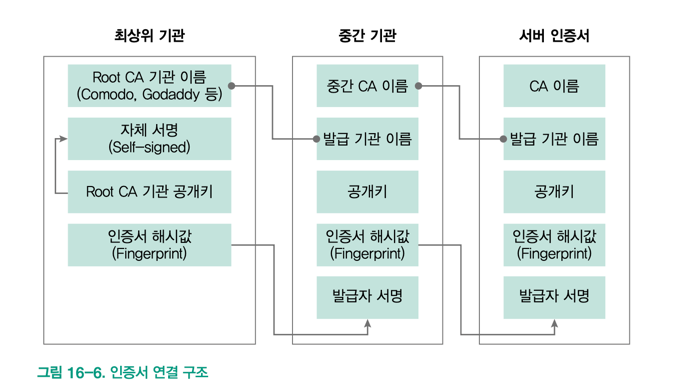
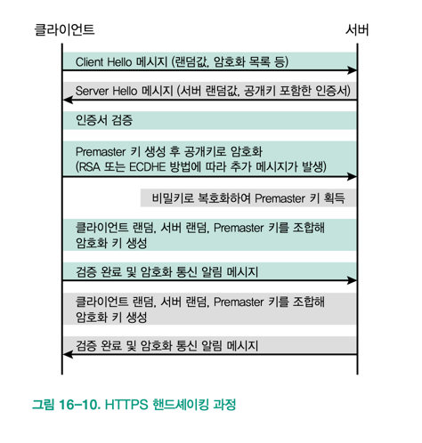

## [ HTTPS ]

### 핵심 한 줄 요약
    무조건 HTTPS 를 이용, Nginx 나 아파치에서 설정, TLS 1.2 이상 => 현 시점에서는 안전한 방법(취약점 발견되면 바로 업데이트 각 보자) 

### 인트로
- HTTPS는 서로 다른 두 컴퓨터가 네트워크를 통해 안전하게 메시지를 주고받기 위해 만든 프로토콜이다.
- HTTPS는 TCP 대신 TLS(전송 계층 보안) 프로토콜을 기반으로 하는 HTTP 라고 이해하면 된다.
- TIP:
  - TLS가 등장하기 전에는 SSL(보안 소켓 계층) 프로토콜을 사용했다.
  - 오늘날 SSL은 너무 많은 취약점으로 사용하지 않지만 라이브러리, 문서 등에서 SSL 이름을 계속 사용한다.
  - 여기서 사용하는 SSL은 TLS와 같다고 생각하면 된다.

### HTTPS 를 사용해야 하는 이유
- 와이어샤크로 HTTP 통신한 패킷을 보면 어우 글씨 다나온다.
- 이렇게 암호화 안해서 주고 받으면 민감한 데이터 오고 갈 때 위험할 수 있다.
- 근데 HTTPS를 사용하면 이 메시지를 암호화하여 알아볼 수가 없다.
- HTTPS는 4계층에서 동작하는 TLS 보다 높은 계층인 7계층에서 동작한다.
- 안전한 키교환 외에도 도메인 주소 신뢰 검사 등 기능도 제공한다.(인증서를 통해)
- ex) TCP 지만 무튼 이런식으로 보인다.
- 
tcp-packet-capture

### HTTPS 구성 요소
- TLS 버전:
  - HTTPS는 전적으로 TLS를 기반으로 하여 TLS 버전에 따라 암호화 목록과 안정성이 달라진다.
  - 높은 버전은 구형 하드웨어나, 소프트웨어에서 호환성 문제가 발생하지만, 더 안전하다.
  - TLS 1.0:
    - 1990년대 말에 재정된 최초의 TLS 버전 SSL 3.0과 일부 호환된다.
    - 오래되서 모든 암호 알고리즘에 취약점이 있다.
    - 요즘은 1.0 프로토콜 사용하면 브라우저에서 경고를 출력하거나 접근을 막기도 한다.
    - 2020년 부터 1.0, 1.1 지원을 중단할 것이고 브라우저 측에서는 발표했다.
  - TLS 1.1
    - 1.0 에서 발견된 취약점들을 보완한 버전이다.
    - 지금은 중단되었지만 유니티 같은 일부 플랫폼에서 가끔 남아 있는 경우가 있다고 한다.
  - TLS 1.2
    - 1.1 에서 서명, 랜덤 함수 등에서 MD5/SHA-1 해시 함수의 사용을 막고 SHA-2 기반으로 바꿨다.
    - 현재 가장 많이 사용하는 버전이다.
- 메시지 암호 키 교환
  - 컴퓨터끼리 암호화해서 주고 받아도, 암호화에 사용하는 키가 노출되면 안전하다고 볼 수 없다.
  - HTTPS 프로토콜은 핸드셰이킹 과정에서 키를 안전하게 교환한다.
  - RSA 알고리즘 or DHE(디피-헬먼) 알고리즘 중 한가지 방법을 사용한다.
  - RSA:
    - 근데 이 알고리즘을 사용한 키 교환 방식은 취약점이 발견 되어서 TLS 1.3 부터는 지원하지 않는다.
    - RSA 알고리즘을 사용해 키를 교환할 때 공개키 하나에 의존하기 때문에 비공개키가 한 번이라도 노출되면 아주 위험하다.
  - DHE(디피-헬먼)
    - 공개키를 주고받은 이후 추가 과정을 더해 키를 만들기 때문에 비밀키가 노출되어도 주고받았던 메시지가 노출 될 일은 없다.
    - 물론 비밀키가 노출되면 앞으로 주고받는 내용을 위험성은 여전히 있다.
    - 이렇게 비밀키가 노출되어도 전에 주고받은 메시지들은 안전한 특성을 PFS 라고 한다.
    - 근데 이거도 취약점이 발견되었다. 그래서 이 취약점을 보완한 ECDHE(타원 곡선 디피-헬먼) 알고리즘을 사용해 HTTPS 키 교환 시 사용한다.
- 인증서(X.509)
    - HTTPS 통신을 하기 위해서는 반드시 인증서가 필요하다.
    - X.509는 이런 인증서를 위한 표준으로 신뢰할 수 있는 인증 기관(CA) 에서만 발급 가능하다.
    - 돈내면 누구나 받을 수 있다. 대부분 미국과 유럽에 있다.
    - 발행 기관, 인증서 버전, 고유 번호, 인증서 소유자, 소유자 정보 를 포함하고 있다.
    - 주의사항:
      - 인증서는 세 가지 종류가 있다. => 싱글 도메인, 멀티 도메인, 와일드 카드 도메인
      - 실무에서는 대부분 와일드 카드 도메인을 구매한다.
      - 인증서 도메인 이름은 최대 64글자까지만 사용할 수 있다.
      - HTTPS URL은 반드시 인증서의 도메인 이름 전체 또는 일부를 포함해야 한다.
    - 사용하는 이유:
      - 암호화 되지 않은 상태에서 키 교환을 하면 중간자가 개입할 수 있다.
      - 그래서 키를 교환하기 전에 서버가 신뢰할 수 있는 서버인지 검증하는 작업이 필요한데 이 과정에서 인증서를 통해 검증한다.
    - 서명:
      - 모든 인증서에는 변조를 막기 위한 서명이 있다.
      - 발급 기관이 제공하는 비밀키를 사용해 만들어진다.
    - 연결구조:
      - 인증서는 '신뢰할 수 있는 기관' 에서 발급받는데 더 상위의 '신뢰할 수 있는 기관' 에서 발급 받고 그걸 받은 중간 기관이 또 발급을 해줄 수 있다.
      - 이게 서로 연결되어 있어서 인증서를 중간 기관에서 발급 받아도 쭉쭉 타고 올라가 신뢰할 수 있는 기관인지 확인할 수 있다.
- ex)

### HTTPS 핸드셰이킹 과정
- 요건 그림 계속 보면 된다.

### 추가 내용
- HTTPS를 소프트웨어 프레임워크에서 설정하는 것 보다는 아파치나 Nginx 에서 설정하는 것이 안전하다.
- TLS 1.0, TLS 1.1 은 중단 됐으니 TLS 1.2 을 사용하자. 레거시는 어쩔 수 없다.
- 가능한 ECDHE 방식의 키 교환만 사용하자.
- letsencrypt 에서 무료로 인증서를 발급 받을 수 있다. 자동 갱신 꼭 해주고 와일드 카드 적용은 좀 어렵다.
