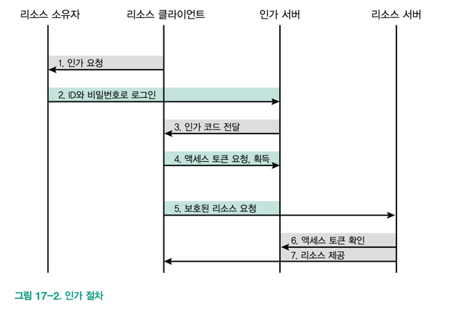

## [ OAuth 2.0 ]

### 핵심 한 줄 요약
     그냥 가져다 쓰면 되는 줄 알았던 OAuth 2.0을 알게되어 재밌는 챕터였다. 주의 점을 꼭 명심해서 사용하도록 하자

### 인트로
- Restful API가 데이터를 간편하게 전달하기 위해 만든 관례라면, Oauth는 간편하고, 안전하게 주고받기 위해 만들어진 표준이다.
- Oauth는 ID, PW 대신에 access token 을 기반으로 사용자를 식별한다.
- 이 토큰은 API를 제공하는 리소스 서버만 발급 할 수 있으며, 일정 시간이 지나면 폐기한다.
- 모든 토큰을 필요한 권한만 지니기 할 수 있어서 서버는 접근 권한을 쉽게 제어할 수 있다는 장점이 있다.

### OAuth 1.0a vs 2.0
- Oauth 표준은 1.0a, 2.0 두 가지가 있다.
- 둘은 이름만 같을 뿐 방식이 다르다.
- Oauth 1.0a
  - 클라이언트가 필요한 권한을 가지고 있는지 확인도 하고, 액세스 토큰 획득 방법도 알 수 있어서 인증과 인가 역할 모두 수행한다.
  - 그래서 2.0 보다 더 안전하다.
  - 근데 2.0에 비해 인증 과정이 복잡하다
  - 표준에서 요구하는 서명 요청 토큰 등 여러 보안 요소를 직접 구현해야 해서 라이브러리도 쉽지 않다.
- Oauth 2.0
  - 1.0a에 있는 인증 절차가 삭제되고, 인가 절차만 남아 1.0a 보다 구조가 간단하며 사용하기 쉽다.
  - 그러나 권한을 확인하는데 사용할 액세스 토큰을 어떻게 얻는지 확인하기 어려워 가로채기 형태의 공격에 취약하다.
  - 2.0 버전에서 인증 기능을 보완할 방법은 전적으로 개발자에게 있다.
  - HTTPS 위에서 사용하는게 기본이다. 그리고 액세스 토큰 만료 시간을 짧게 가져가거나, 발급한 IP만 동작하게 하는 등 조치가 필요할 수도 있다.

### Oauth 2.0 용어
- 리소스 소유자
  - 리소스 서버에서 제공하는 기능을 실제로 사용할 주체
  - 액세스 토큰을 획득하게 될 주체로 이해하면 된다.
  - 최종 사용자 라고 한다. 상황에 따라 클라이언트나 백엔드 서버와 같은 컴퓨터도 주체가 될 수 있다.
- 리소스 클라이언트
  - 리소스 소유자로부터 사용 인가를 받아, 소유자 대신 액세스 토큰을 획득하여 리소스 서버의 API를 사용하는 주체
  - 구글, 카카오, 네이버 등 인증 기능을 사용하는 다양한 모바일 앱, 웹 서비스 등이다.
  - 리소스 소유자의 인가가 있어야 사용할 수 있다.
- 인가 서버
  - 액세스 토큰과 인가 코드를 관리하는 서버
  - 올바른 액세스 토큰인지 검증도 하고, 만료된 액세스 토큰을 폐기도 한다.
  - 클라이언트 요청을 제어하기 위해 클라이언트 ID와, 시크릿 정보를 관리한다.
- 리소스 서버
  - 보호된 리소스를 관리하며 클라이언트가 사용할 API를 제공하는 주체
  - API를 사용하려면 액세스 토큰이 필요하며 유효한지 확인하기 위해 인가 서버와 통신 한다.
  - 근데 API를 쓸 때마다 유효성을 확인하면 인가 서버의 부하가 커져서 내역을 캐싱하거나, JWT를 사용하기도 한다.

### OAuth 2.0 동작 구조

### OAuth 2.0 사용시 주의할 점
- 리소스 소유자
  - 리소스 소유자는 인가 요청이 들어오면 적절한 권한을 요청하는지 확인하기 어려운 경우가 많다.
  - 그래서 개발 할 때 사용자에게 어떤 권한을 요구할지 정확하게 확인하고 알려야 한다.
  - 올바른 권한 요청은 GDPR 기준을 충족하기 위한 조건 중 하나이기도 하다.
- 리소스 클라이언트
  - 액세스 토큰 관리:
    - 유효기간을 짧게 설정하고 자주 갱신하는게 좋다.
    - 만료된 액세스 토큰은 절대 사용하지 않도록 하자.
  - 클라이언트 ID 및 시크릿 관리:
    - 리소스 클라이언트가 API를 사용하기 위해서는 앱을 출시하기전 API를 제공하는 구글, 카카오 등에서 사전 허가를 받아야 한다.
    - 클라이언트 ID와 시크릿 키를 할당 받는데 이게 꼭 있어야 하고, 소스 코드나 저장소에 포함시키면 안된다. 
    - 조금만 변경되어도 재생성하거나 폐기해야 한다.
  - HTTPS 사용
    - 그래야 중간자 공격 같은 보안 위협을 방지할 수 있다.
- 리소스 서버
  - OAuth 2.0을 직접 구현할 경우에만 해당된다.
  - 액세스 토큰 권한 검사:
    - 적절한 시점에 액세스 토큰이 유효한지 인증 서버로 요청해 확인해야 한다.
    - 적절한 권한도 확인해야 한다.
  - 클라이언트 데이터 검증:
    - 클라이언트에 받은 모든 데이터를 신뢰하면 안된다.
    - 모든 데이터는 이스케이프 과정을 거치고, 브라우저의 경우 항상 Content-Type을 application/json으로 설정해야 악성 스크립트 실행을 방지할 수 있다.
- 인가 서버
  - 이거도 OAuth 2.0을 직접 구현할 때만 해당된다.
  - 인가 서버는 액세스 토큰의 생성 및 즉각 폐기할 수 있어야 하고 실질적인 담당 주체이다.
  - 높은 수준의 보안이 필요하다.
  - 액세스 토큰 관리:
    - 액세스 토큰의 재사용을 막기 위해 최대한 짧은 만료 시간을 가지는게 좋다.
    - 만료 시간이 짧으면 토큰을 더 많이 생성해야 하므로 인증 서버의 부하도 커진다는 걸 염두에 둬야 한다.
  - 리소스 클라이언트 응답 처리:
    - 클라이언트가 액세스 토큰을 욫어할 때 요청 주소와, 액세스 토큰 생성 후 토큰을 실제 클라이언트로 전달할 응답 주소가 완전히 일치하는지 확인해야 한다.
    - 다르면 중간자 공격 등에 의한 해킹일 수도 있다.
    - 액세스 토큰 생성 과정에서 필수 인수가 없거나 올바르지 않은 값을 발견했다면 내부 개발자는 공격자가 알 수 없게 출력할 에러 최소화, 간략한 정보만 보여주는게 좋다.

### 추가 내용
- OAuth 2.0은 구글, 페이스북 같은 공개 API를 활용할 때 처음 접하게 되는 표준
- 이 기능을 구현할 때 OAuth 표준이 반드시 필요하다.
- OAuth 서버를 직접 구현하는 일은 드물지만 만약 구현한다면 많은 서비스를 벤치마킹 해보는게 좋다.
- JWT 를 사용하면 인가 서버의 부하를 줄일 수 있다.
- OAuth 2.0은 공격에 취약한 만큼 이에 대한 대처 방법도 많다. 많이 찾아보자!
- OAuth 2.0은 인증이 아닌 인가를 제공하는 표준이다. 그렇다고 인증 서버를 만드는게 불가능 한 것도 아니다.
